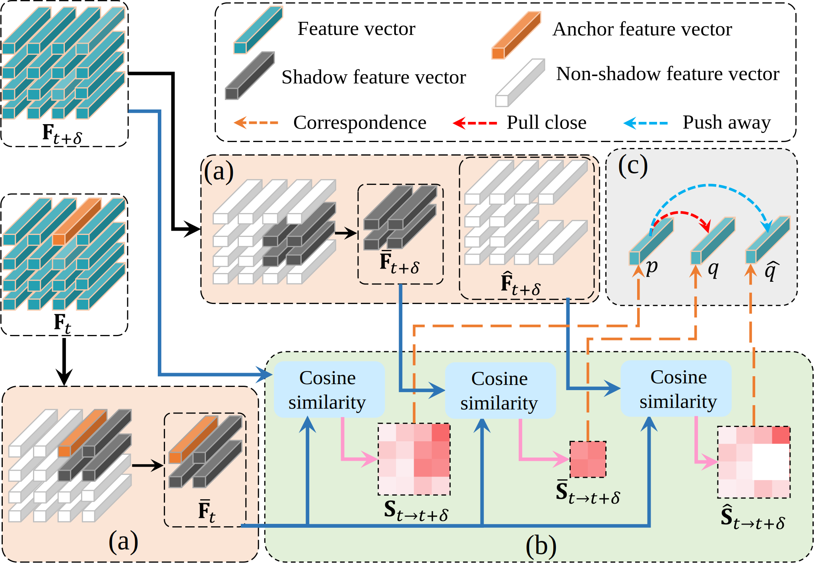

# Learning Shadow Correspondence for Video Shadow Detection

## Introduction

This is a PyTorch implementation of **[Learning Shadow Correspondence for Video Shadow Detection]**[ECCV22].


Framework visualization


## Preparation

**Datasets**
ViSha dataset is available at **[ViSha Homepage](https://erasernut.github.io/ViSha.html)**


## Run the code


**Installation**
  ```
    MedPy==0.4.0
    numpy==1.20.3
    Pillow==9.2.0
    pydensecrf==1.0rc2
    torch==1.9.0
    torchvision==0.10.0
    tqdm==4.61.2

  ``` 
  or

  ```
   pip install -r requirements.txt
  ```

**Train the model**
  ```shell
   python train.py
  ```
You can also down the trained model from [Google Driver](https://drive.google.com/file/d/1zSY2QWqauncB29ALov7q6yjWSZPc08GU/view) and put them in ckpt/models.

**Testing**

```
python test.py
```

**Citation**
If this code is useful for your research, please consider citing:

```
@inproceedings{ding2022learning,
  title={Learning Shadow Correspondence for Video Shadow Detection},
  author={Xinpeng Ding, Jingwen Yang, Xiaowei Hu and Xiaomeng Li},
  booktitle={Proceeding of the 17th European Conference on Computer Vision, ECCV},
  year={2022}
}
```


